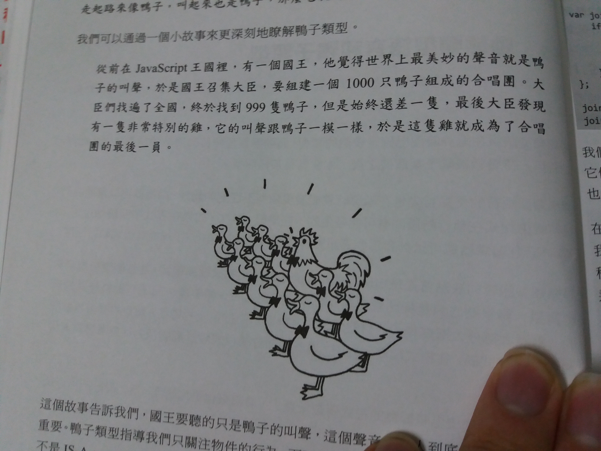
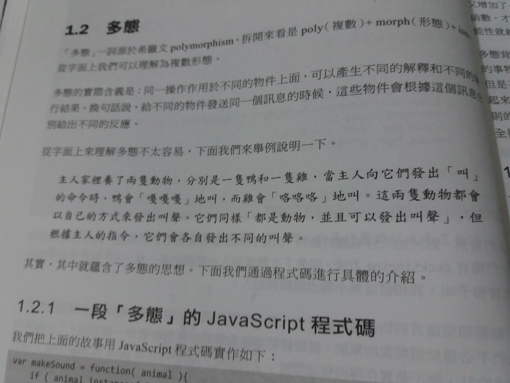

# 打開設計模式的大門：物件導向javascript

## 鴨子的範例(來源：書本P.4)



將以上例子以程式碼來呈現

```javascript
var duck = {
    duckSinging: () => console.log('嘎嘎嘎')
}

var chicken = {
    duckSinging: () => console.log('嘎嘎嘎')
}

var choir = [];

var joinChoir = (animal) => {
    if (animal && (typeof animal.duckSinging) === 'function') {
        choir.push(animal)
        console.log('恭喜加入合唱團')
        console.log('合唱團已有成員數量: ' + choir.length)
    }
}

joinChoir(duck)
joinChoir(chicken)
```

以node執行

    node program1.js

出現以下結果

    恭喜加入合唱團
    合唱團已有成員數量: 1
    恭喜加入合唱團
    合唱團已有成員數量: 2

我們可以發現，在joinChoir我們不需要去檢查animal是"哪一種"，只需要去檢查animal有沒有duckSinging方法。
這就是物件導向的概念，在設計模式的事件中，這叫做"介面導向設計"，是為設計模式的重要思想。

## 多態(來源：書本P.6)



將以上例子以程式碼呈現

```javascript
var makeSound = (animal) => {
    if (animal instanceof Duck) console.log('嘎嘎嘎')
    else if (animal instanceof Chicken) console.log('顆顆顆')
}

var Duck = function() { }
var Chicken = function() { }

// 如果改成以下程式似乎不能執行.....
// var Duck=()=>{}
// var Chicken=()=>{}

makeSound(new Duck())
makeSound(new Chicken())
```

以node執行

    node program2.js

出現以下結果

    嘎嘎嘎
    顆顆顆

以上程式碼體現程式的多態性，但只要輸入參數有不同種就必須更動makeSound函式。
因此正確的作法應是"不動的部分固定，變動的訊息切開"，以program3.js為例

ps. new關鍵字定義:The new operator creates an instance of a user-defined object type or of one of the built-in object types that has a constructor function.
(來源：https://goo.gl/UL5eoJ)

```javascript
var makeSound = (animal) => {
    animal.sound()
}

var Duck = function () { }
Duck.prototype.sound = () => console.log('嘎嘎嘎')

var Chicken = function () { }
Chicken.prototype.sound = () => console.log('顆顆顆')

var Dog = function () { }
Dog.prototype.sound = () => console.log('旺旺旺')

makeSound(new Duck())
makeSound(new Chicken())
// makeSound(new Dog())
```

## javascript的原型模式

原型模式：不關心物件的具體類型，而是找到一物件，通過複製來建立一個一模一樣的物件。程式碼program4.js：

```javascript
var Plane = function () {
    this.blood = 100
    this.attackLevel = 1
    this.defenseLevel = 1
}

var plane = new Plane()
plane.blood = 500
plane.attackLevel = 10
plane.defenseLevel = 7

var planeInstance = Object.create(plane)
console.log('blood: ' + planeInstance.blood)
console.log('attackLevel: ' + planeInstance.attackLevel)
console.log('defenseLevel: ' + planeInstance.defenseLevel)
```

原型模式的關鍵在於本身是否提供clone方法，ES5提供Object.create來複製物件

ps. Object.create定義：以指定的原型物件以及屬性來建立新的物件(來源：https://goo.gl/DrxIJD)

## javascript的原型繼承

javascript的四大運作法則

1. 萬物皆物件
2. 找到一個物件作為原型(prototype)複製它即能得出物件
3. 物件會記住它的原型
4. 如果物件無法回應某個請求，它會把該請求委託給它的原型

原型繼承範例(program5.js)：

```javascript
var obj = { name: 'sven' }
var A = function () { }
A.prototype = obj

var a = new A()
console.log(a.name)
```

ES6實現繼承(program6.js)：

```javascript
class Animal {
    constructor(name) {
        this.name = name
    }

    getName() {
        return this.name
    }
}

class Dog extends Animal {
    constructor(name) {
        super(name)
    }

    speak() {
        return 'woof'
    }
}

var dog = new Dog('Scamp')
console.log(dog.getName()+' says '+dog.speak())
```
